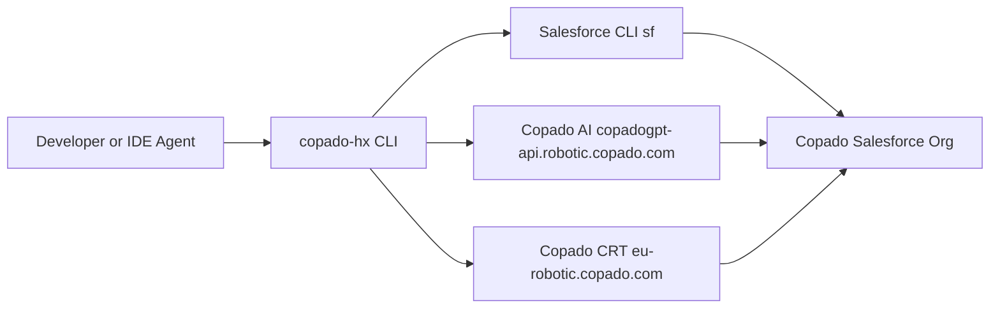

# TrinetraOps — Headless Copado DevOps CLI

**TrinetraOps** is a fully working headless DevOps CLI that lets developers and AI agents complete the entire Copado delivery lifecycle — story → commit → promote → test → deploy — without ever opening the Copado UI.

Everything runs from the terminal. Every command is live against a real Copado org.

---

## What Is Built

| Capability | Status | How It Works |
|---|---|---|
| Story listing & context | **Live** | Queries Copado org via Salesforce CLI (`sf data query`) |
| Commit | **Live** | Pushes to Copado feature branch via `sf copado story push` |
| Promote | **Live** | Queues promotion via Copado |
| Deploy | **Live** | Deployment with production approval guardrail |
| CRT Test execution | **Live** | Triggers and polls Copado Robotic Testing API |
| Copado AI agents | **Live** | Calls `copadogpt-api.robotic.copado.com` with story context |
| Doctor Engine | **Live** | AI-powered root cause analysis for failed jobs |
| Replay Engine | **Live** | Full timeline reconstruction for any Copado entity |
| Mock fallback | **Always available** | All commands work offline with no credentials |

---

## Architecture



### Key Design Principle

AI does not call Copado APIs directly. Humans and AI agents both call the CLI. The CLI calls Copado. This keeps authentication, policy enforcement, approval gates, and workflow logic in one place — the CLI is the safety boundary.

### Layer Breakdown

```
src/
  commands/        CLI argument parsing and output
  services/        Business logic and orchestration
  clients/
    salesforce-client.ts   sf CLI bridge — SOQL + Apex execution
    ai-client.ts           Copado AI chat completions (live + mock)
    crt-client.ts          Copado Robotic Testing API (live + mock)
    cicd-client.ts         CI/CD via sf copado story push (live + mock)
    env-config.ts          Central env var reader
  doctor/          Trinetra Doctor Engine — intelligent diagnostics
  replay/          Trinetra Replay Engine — timeline reconstruction
  state/           Local config and session persistence
  policies/        Deployment approval and guardrail enforcement
  types/           TypeScript type definitions
```

---

## Prerequisites

- Node.js 20 or later
- Salesforce CLI (`sf`) with Copado plugin
- A Copado org authenticated via `sf org login`

### Install Salesforce CLI + Copado plugin

```bash
npm install -g @salesforce/cli
sf plugins install @copado/copado-cli
```

### Authenticate your Copado org

```bash
sf org login web --alias copadotrial --instance-url https://<your-org>.my.salesforce.com
sf copado auth set --alias copadotrial
```

---

## Install & Build

```bash
npm install
npm run build
npm link           # makes copado-hx available globally
```

---

## Demo — Full Delivery Lifecycle

Run these commands in order to walk through the complete headless Copado workflow.

### 1. Check connection status
```bash
copado-hx auth status
```

### 2. List real stories from your Copado org
```bash
copado-hx story list
```

### 3. Set the active story
```bash
copado-hx story set --id US-0000025
```

### 4. Show story details
```bash
copado-hx story show --id US-0000025
```

### 5. Ask the AI planning agent
```bash
copado-hx ai ask --agent plan "What do I need to deliver this story end to end?"
```

### 6. Ask the AI build agent for commit readiness
```bash
copado-hx ai ask --agent build "Is this story ready to commit?"
```

### 7. Commit — live push to Copado feature branch
```bash
copado-hx commit --message "feat: headless commit via TrinetraOps CLI"
```
> Runs `sf copado story push` under the hood. The commit appears in the Copado UI immediately.

### 8. Promote to UAT
```bash
copado-hx promote --env UAT
```

### 9. Run CRT tests
```bash
copado-hx test run --suite 120953
```
> Note the **Execution ID** printed — use it in the next two steps.

### 10. Check test status
```bash
copado-hx test status --execution <EXECUTION-ID>
```

### 11. Diagnose the test result with Doctor Engine
```bash
copado-hx doctor test <EXECUTION-ID>
```
> AI-powered root cause analysis. Tells you exactly why a test failed and what to fix.

### 12. Replay the full story timeline
```bash
copado-hx replay US-0000025
```
> Reconstructs every commit, promotion, test run, and deployment for this story in one view.

### 13. Ask the AI release agent for go/no-go
```bash
copado-hx ai ask --agent release "Is US-0000025 ready for PROD deployment?"
```

### 14. Deploy to PROD (approval guardrail fires)
```bash
copado-hx deploy --env PROD
```
> Interactive approval prompt appears. Type `yes` to proceed. Cannot be bypassed by automation.

### 15. Final status dashboard
```bash
copado-hx status
```

---

## All Commands

### Authentication
```bash
copado-hx auth status
copado-hx auth login
copado-hx auth logout
```

### Story Context
```bash
copado-hx story list
copado-hx story set --id <story-id>
copado-hx story show --id <story-id>
copado-hx story current
```

### Pipeline Operations
```bash
copado-hx commit --message <message>
copado-hx promote --env <environment> [--validate]
copado-hx deploy --env <environment> [--approve]
copado-hx status [--watch]
```

### Testing
```bash
copado-hx test run --suite <suite-id>
copado-hx test status --execution <execution-id>
copado-hx test results --execution <execution-id>
```

### AI Agents
```bash
copado-hx ai ask --agent plan "<prompt>"
copado-hx ai ask --agent build "<prompt>"
copado-hx ai ask --agent test "<prompt>"
copado-hx ai ask --agent release "<prompt>"
copado-hx ai ask --agent operate "<prompt>"
```

### Doctor Engine — Intelligent Diagnostics
```bash
copado-hx doctor deployment <id>
copado-hx doctor promotion <id>
copado-hx doctor test <id>
copado-hx doctor commit <id>
copado-hx investigate [id]
copado-hx why [id]
```

### Replay Engine — Timeline Reconstruction
```bash
copado-hx replay <id>
# Auto-detects type from ID prefix:
# US-  = user story
# DEP- = deployment
# PRO- = promotion
# EX-  = test execution
# COM- = commit
```

---

## Live vs Mock

The CLI automatically uses live integrations when credentials are present in the environment and falls back to mock data when they are not. No config change needed.

| Service | Live when | Endpoint |
|---|---|---|
| Stories / SOQL | `sf` CLI session active | Salesforce org SOQL |
| Commit | `sf` CLI + Copado plugin | `sf copado story push` |
| Promote / Deploy | Copado CLI authenticated | Copado Salesforce org |
| AI agents | `COPADO_AI_TOKEN` set | `copadogpt-api.robotic.copado.com` |
| CRT tests | `COPADO_CRT_TOKEN` set | `eu-robotic.copado.com` |

---

## Guardrails

These are enforced by the CLI regardless of how it is invoked — terminal, IDE, or AI agent:

- Production deploys require explicit human approval — cannot be automated away
- Story IDs, suite IDs, and execution IDs must be looked up — never guessed
- Deploy cannot proceed if required validation or tests failed
- AI agents can recommend and orchestrate, but they cannot bypass policy

---

## Environment Variables

```bash
# Copado org
COPADO_COPADO_ORG_USERNAME=you@yourorg.com

# Copado AI
COPADO_AI_BASE_URL=https://copadogpt-api.robotic.copado.com
COPADO_AI_ORGANIZATION_ID=<org-id>
COPADO_AI_WORKSPACE_ID=<workspace-id>
COPADO_AI_TOKEN=<token>

# Copado Robotic Testing
COPADO_CRT_BASE_URL=https://eu-robotic.copado.com
COPADO_CRT_ORGANIZATION_ID=<org-id>
COPADO_CRT_PROJECT_ID=<project-id>
COPADO_CRT_TOKEN=<token>
```

---

## CI

GitHub Actions at `.github/workflows/ci.yml` runs on every push and pull request:

```
npm ci → tsc --noEmit → npm run build → npm test
```

---

## Tests

```bash
npm test
```

Covers:
- Production deployment guardrail blocking unapproved PROD deploys
- Story context service listing and persisting active story (runs against live org when `sf` session is active)
---
<!-- US-0000027 -->
> **Story US-0000027 — test-ashish branch**: Change committed via `copado-hx` CLI on 2 June 2026.
