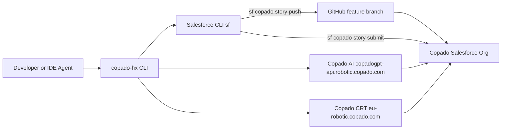

# TrinetraOps — Headless Copado DevOps CLI

**TrinetraOps** is a fully working headless DevOps CLI that lets developers and AI agents complete the entire Copado delivery lifecycle — story → commit → promote → deploy — without ever opening the Copado UI.

Everything runs from the terminal. Every command is live against a real Copado org.

---

## What Is Built

| Capability | Status | How It Works |
|---|---|---|
| Story listing, show, set, update | **Live** | Queries Copado org via `sf data query` (SOQL) |
| Commit | **Live** | Pushes to Copado feature branch via `sf copado story push` |
| Promote | **Live** | Flags story as Ready to Promote via `sf copado story submit --promote` |
| Deploy | **Live** | Triggers deployment via `sf copado story submit --deploy` |
| CRT Test execution | **Live** | Triggers and polls Copado Robotic Testing API |
| Copado AI agents | **Live** | Calls `copadogpt-api.robotic.copado.com` with story context |
| Doctor Engine | **Live** | AI-powered root cause analysis for failed jobs |
| Replay Engine | **Live** | Full timeline reconstruction for any Copado entity |
| Mock fallback | **Always available** | All commands work offline with no credentials |

---

## Architecture



### Key Design Principle

AI does not call Copado APIs directly. Humans and AI agents both call the CLI. The CLI calls Copado. This keeps authentication, policy enforcement, approval gates, and workflow logic in one place — the CLI is the safety boundary.

### How the CI/CD Layer Works

All pipeline operations delegate to the **Salesforce CLI Copado plugin** (`sf copado`):

| `copado-hx` command | Underlying `sf` command |
|---|---|
| `commit` | `sf copado story push` |
| `promote` | `sf copado story submit --promote` |
| `promote --validate` | `sf copado story submit --validate` |
| `deploy` | `sf copado story submit --deploy` |

This means the CLI inherits the authenticated Salesforce session managed by `sf` — no token management needed.

---

## Prerequisites

- Node.js 20 or later
- Salesforce CLI (`sf`) with Copado plugin
- A Copado org authenticated via `sf org login`
- **Must be run from inside your Salesforce project repo** (the repo linked to the Copado pipeline)

### Install Salesforce CLI + Copado plugin

```bash
npm install -g @salesforce/cli
sf plugins install @copado/copado-cli
```

### Authenticate your Copado org

```bash
sf org login web --alias copadotrial --instance-url https://<your-org>.my.salesforce.com
sf copado auth set --alias copadotrial
```

---

## Install & Build

```bash
git clone https://github.com/DevSudhit/Copado_Headless_Agent.git
cd Copado_Headless_Agent
npm install
npm run build
npm link           # makes copado-hx available globally in any directory
```

---

## Critical — Run from Your Salesforce Project Repo

The `commit`, `promote`, and `deploy` commands must be run from inside the repo that is **linked to your Copado pipeline** (e.g. `Copado-SJ310526CPHSFP`), not from `Copado_Headless_Agent`.

```bash
# Clone your Salesforce project repo
git clone git@github.com:DevSudhit/Copado-SJ310526CPHSFP.git
cd Copado-SJ310526CPHSFP
git checkout feature/US-0000027   # or whichever story branch

# copado-hx is globally installed — works from any directory
copado-hx story set --id US-0000027
copado-hx commit --message "feat: my change"
copado-hx promote --env UAT
copado-hx deploy --env PROD --approve
```

---

## Demo — Full Delivery Lifecycle

### 1. Check connection
```bash
copado-hx auth status
```

### 2. List real stories from your Copado org
```bash
copado-hx story list
```

### 3. Set the active story
```bash
copado-hx story set --id US-0000027
```

### 4. Ask the AI planning agent
```bash
copado-hx ai ask --agent plan "What do I need to deliver this story end to end?"
```

### 5. Ask the AI build agent for commit readiness
```bash
copado-hx ai ask --agent build "Is this story ready to commit?"
```

### 6. Commit — pushes to Copado feature branch via sf copado story push
```bash
copado-hx commit --message "feat: my change"
```
> Runs `sf copado story push` under the hood. The commit appears in the Copado UI → story → Git Changes tab immediately.

### 7. Promote to UAT — triggers via sf copado story submit --promote
```bash
copado-hx promote --env UAT
```
> Flags the story as Ready to Promote. Copado creates a Promotion record and runs the pipeline. Visible in Copado UI → Promotions tab.

### 8. Run CRT tests
```bash
copado-hx test run --suite <suite-id>
```
> Note the **Execution ID** printed.

### 9. Check test status
```bash
copado-hx test status --execution <execution-id>
```

### 10. Diagnose a failure with Doctor Engine
```bash
copado-hx doctor test <execution-id>
```

### 11. Replay the full story timeline
```bash
copado-hx replay US-0000027
```

### 12. Ask the AI release agent for go/no-go
```bash
copado-hx ai ask --agent release "Is US-0000027 ready for PROD deployment?"
```

### 13. Deploy to PROD — triggers via sf copado story submit --deploy
```bash
copado-hx deploy --env PROD --approve
```
> Interactive approval prompt fires first. Runs `sf copado story submit --deploy`. Visible in Copado UI → Promotions tab as a deployment record.

### 14. Mark story as completed
```bash
copado-hx story update --id US-0000027 --status Completed
```

### 15. Final status dashboard
```bash
copado-hx status
```

---

## All Commands

### Authentication
```bash
copado-hx auth status
copado-hx auth login
copado-hx auth logout
```

### Story Context
```bash
copado-hx story list
copado-hx story set --id <story-id>
copado-hx story show --id <story-id>
copado-hx story current
copado-hx story update --id <story-id> --status <status>
```

### Pipeline Operations
```bash
copado-hx commit --message <message>
copado-hx promote --env <environment> [--validate]
copado-hx deploy --env <environment> [--approve]
copado-hx status [--watch]
```

### Testing
```bash
copado-hx test run --suite <suite-id>
copado-hx test status --execution <execution-id>
copado-hx test results --execution <execution-id>
```

### AI Agents
```bash
copado-hx ai ask --agent plan "<prompt>"
copado-hx ai ask --agent build "<prompt>"
copado-hx ai ask --agent test "<prompt>"
copado-hx ai ask --agent release "<prompt>"
copado-hx ai ask --agent operate "<prompt>"
```

### Doctor Engine — Intelligent Diagnostics
```bash
copado-hx doctor deployment <id>
copado-hx doctor promotion <id>
copado-hx doctor test <id>
copado-hx doctor commit <id>
copado-hx investigate [id]
copado-hx why [id]
```

### Replay Engine — Timeline Reconstruction
```bash
copado-hx replay <id>
# Auto-detects type from ID prefix:
# US-  = user story
# DEP- = deployment
# PRO- = promotion
# EX-  = test execution
# COM- = commit
```

---

## Live vs Mock

The CLI automatically uses live integrations when the `sf` CLI session is active and env vars are present. Falls back to mock when not.

| Service | Live when | Underlying tool |
|---|---|---|
| Stories / SOQL | `sf` CLI session active | `sf data query` |
| Commit | `sf` CLI + Copado plugin | `sf copado story push` |
| Promote | `sf` CLI + Copado plugin | `sf copado story submit --promote` |
| Deploy | `sf` CLI + Copado plugin | `sf copado story submit --deploy` |
| AI agents | `COPADO_AI_TOKEN` set | `copadogpt-api.robotic.copado.com` |
| CRT tests | `COPADO_CRT_TOKEN` set | `eu-robotic.copado.com` |

---

## Environment Variables

```bash
# Copado AI
COPADO_AI_BASE_URL=https://copadogpt-api.robotic.copado.com
COPADO_AI_ORGANIZATION_ID=<org-id>
COPADO_AI_WORKSPACE_ID=<workspace-id>
COPADO_AI_TOKEN=<token>

# Copado Robotic Testing
COPADO_CRT_BASE_URL=https://eu-robotic.copado.com
COPADO_CRT_ORGANIZATION_ID=<org-id>
COPADO_CRT_PROJECT_ID=<project-id>
COPADO_CRT_TOKEN=<token>
```

---

## Guardrails

These are enforced by the CLI regardless of how it is invoked:

- Production deploys require explicit human approval — cannot be automated away
- Story IDs, suite IDs, and execution IDs must be looked up — never guessed
- AI agents can recommend and orchestrate, but cannot bypass policy

---

## CI

GitHub Actions at `.github/workflows/ci.yml` runs on every push and pull request:

```
npm ci → tsc --noEmit → npm run build → npm test
```

---

## Tests

```bash
npm test
```

Covers:
- Production deployment guardrail blocking unapproved PROD deploys
- Story context service listing and persisting active story (runs against live org when `sf` session is active)