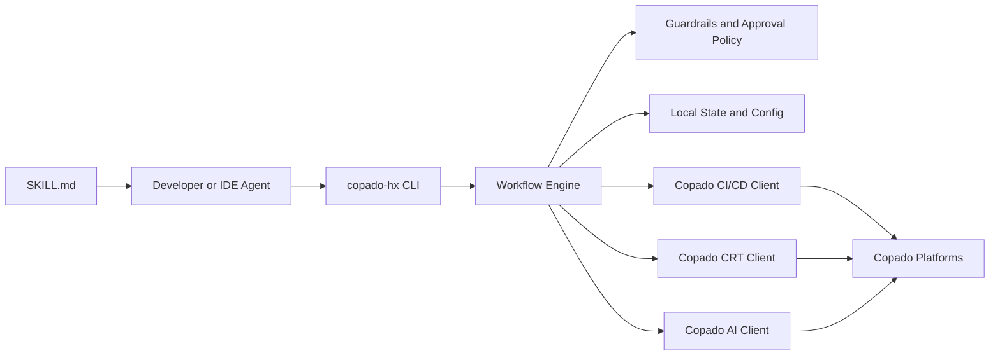

# Copado Headless Agent

`Copado Headless Agent` is a proposed headless DevOps tool for the Copado Hackathon.

The goal is to let a developer complete the Copado delivery lifecycle without opening the Copado UI. Everything should be runnable from the terminal, from an IDE, or by an AI agent that uses the same command surface.

## Status

This repository now contains an initial TypeScript CLI scaffold.

Current implementation state:

- mock-mode CLI is runnable locally
- story context persists in local project state
- commit, promote, deploy, test, and ai flows are wired through mock clients
- production deploys require explicit approval via `--approve`
- live Copado API clients are not wired yet

## Current Scope

The current codebase is intentionally split into two phases:

- Phase 1: a working headless CLI shell with policy enforcement, local state, and mock integrations
- Phase 2: real Copado API clients for CI/CD, CRT, and AI

This keeps the command surface stable while we replace mock adapters with real API integrations.

## Quick Start

### Prerequisites

- Node.js 20 or later
- npm 10 or later

### Install

```bash
npm install
```

### Build

```bash
npm run build
```

### Run

```bash
node dist/index.js --help
```

### Example Mock Flow

```bash
node dist/index.js auth status
node dist/index.js story list
node dist/index.js story set --id US-1234
node dist/index.js commit --message "feat: scoring updates"
node dist/index.js promote --env UAT --validate
node dist/index.js test run --suite smoke
node dist/index.js ai ask --agent plan "summarize the story"
node dist/index.js deploy --env PROD --approve
```

### Local State

- `.copado-hx.json` stores non-secret project configuration such as runtime mode
- `.copado-hx.state.json` stores local workflow context such as the active story

### Live Mode Note

The CLI already supports a `live` runtime setting in the config model, but the real Copado HTTP clients are not implemented yet.

That means today:

- `mock` mode works end to end for local demos and workflow design
- `live` mode is a placeholder that preserves the final architecture while the API layer is being built

## Problem We Are Solving

The hackathon asks for a workflow where a developer can do all of the following without a browser:

- authenticate with Copado
- select a user story
- commit changes
- promote to target environments
- run automated tests
- deploy to production
- use Copado AI agents during the lifecycle

The product we are designing is not a terminal dashboard. It is a safe command layer over Copado APIs.

## Proposed Solution

We propose a `git`-like CLI, tentatively named `copado-hx`, with a Track A core and Track B extension:

- Track A: a human-friendly CLI for end-to-end Copado delivery
- Track B: an AI-ready orchestration layer using `SKILL.md`, so tools like VS Code, Cursor, or other agents can execute the same workflow safely

The CLI becomes the single operating surface for both humans and AI.

## What The Judges Likely Care About

This architecture is optimized for the likely judging criteria:

- Headless impact: prove a real browser-free workflow
- Developer experience: simple commands, clear output, predictable behavior
- Working demo: show one full golden path from story to deployment
- Innovation: add AI value without removing control or safety

## Architecture Overview

The system is designed as a layered architecture with the CLI as the control point.

### 1. Interface Layer

This is the surface used by developers and AI agents.

- CLI commands such as `auth`, `story`, `commit`, `promote`, `test`, `deploy`, and `ai`
- structured output with `--json` for machine-readable execution
- human-readable output for terminal-first use

### 2. Workflow Layer

This layer coordinates multi-step operations.

Examples:

- `story set --id US-1234` stores the active delivery context
- `promote --env UAT --validate` resolves current context, checks policy, calls Copado APIs, and reports status
- `deploy --env PROD` requires explicit approval before proceeding

### 3. Integration Layer

This layer isolates direct communication with external platforms.

- CI/CD client for commit, promote, validate, deploy, and status operations
- CRT client for test execution, polling, and results
- AI client for conversations with Copado agents such as `plan`, `build`, `test`, `release`, and `operate`

### 4. State and Security Layer

This layer stores local execution context and secrets.

- secure token storage using OS keychain integration
- local config file such as `.copado-hx.json`
- active story context
- environment aliases and policy settings

### 5. Policy and Guardrails Layer

This layer prevents unsafe automation.

- production deploys require explicit human approval
- IDs must be selected, not guessed
- deploys cannot skip validation or required tests
- AI can recommend and orchestrate, but it cannot bypass policy

## Why The CLI Is The Safety Boundary

The most important design choice is that AI should not call Copado APIs directly.

Instead:

- humans call the CLI
- AI agents call the CLI
- the CLI calls Copado APIs

This keeps authentication, validation rules, approval checks, output formats, and workflow logic in one place.

## High-Level System Diagram



## Core User Experience

The golden path we want to support is:

```bash
copado-hx auth login
copado-hx story list
copado-hx story set --id US-1234

copado-hx ai ask --agent plan "summarize the story and suggest the implementation plan"
copado-hx commit --message "feat: scoring updates"
copado-hx promote --env UAT --validate

copado-hx test run --suite smoke
copado-hx test status --execution EX-001
copado-hx test results --execution EX-001

copado-hx deploy --env PROD
copado-hx ai ask --agent release "generate release notes for this deployment"
```

This flow demonstrates the headless DevOps lifecycle end to end.

## Proposed Command Surface

### Authentication

- `copado-hx auth login`
- `copado-hx auth status`
- `copado-hx auth logout`

### Story Context

- `copado-hx story list`
- `copado-hx story show --id <story-id>`
- `copado-hx story set --id <story-id>`
- `copado-hx story current`

### Pipeline Operations

- `copado-hx commit --message <message>`
- `copado-hx promote --env <environment> [--validate]`
- `copado-hx deploy --env <environment>`
- `copado-hx status`

### Testing

- `copado-hx test run --suite <suite-id>`
- `copado-hx test status --execution <execution-id>`
- `copado-hx test results --execution <execution-id>`

### AI Operations

- `copado-hx ai ask --agent plan "..."`
- `copado-hx ai ask --agent build "..."`
- `copado-hx ai ask --agent test "..."`
- `copado-hx ai ask --agent release "..."`
- `copado-hx ai ask --agent operate "..."`

## Suggested Code Structure

We recommend building this as a Node.js and TypeScript CLI.

```text
src/
	commands/
		auth/
		story/
		commit/
		promote/
		deploy/
		test/
		ai/
	clients/
		cicd-client.ts
		crt-client.ts
		ai-client.ts
	services/
		auth-service.ts
		story-context-service.ts
		pipeline-service.ts
		testing-service.ts
		ai-agent-service.ts
	policies/
		approval-policy.ts
		deployment-policy.ts
	state/
		config-store.ts
		token-store.ts
		context-store.ts
	output/
		formatter.ts
		json-output.ts
	types/
		api.ts
		commands.ts
	index.ts
```

## Suggested Responsibilities By Module

### Command Modules

Parse arguments, validate user input, and call services.

### Service Modules

Contain workflow logic and orchestration across multiple API calls.

### API Client Modules

Contain raw HTTP logic, request building, authentication headers, and response parsing.

### State Modules

Store active story, config, and secure tokens.

### Policy Modules

Enforce approval and environment restrictions before executing sensitive operations.

## Guardrails

These guardrails are essential for both safety and judging quality:

- never deploy to production without explicit approval
- never guess story IDs, suite IDs, or execution IDs
- never allow deployment if required validation or tests failed
- never hide failures behind vague AI responses
- always return clear exit codes and actionable errors

## Track B Strategy

Once the CLI is stable, we add `SKILL.md` so an IDE agent can chain commands safely.

The `SKILL.md` should teach the agent:

- what commands exist
- when to use each command
- what order to follow for common workflows
- which actions require approval
- which assumptions are forbidden

This turns the CLI into an agent-compatible operating surface without giving the agent unsafe direct access.

## Recommended Implementation Plan

### Phase 1: Foundation

- initialize CLI project
- implement auth and local config
- implement story selection and context persistence

### Phase 2: Core Delivery Flow

- implement commit
- implement promote and validation
- implement deploy with approval checks

### Phase 3: Testing

- implement CRT test execution
- implement status polling and results formatting

### Phase 4: AI Integration

- implement `ai ask`
- pass story and environment context into prompts where useful

### Phase 5: Agentic Workflow

- add `SKILL.md`
- document safe workflow chains for IDE agents

## Assumptions To Confirm Before Implementation

The architecture is ready, but these integration details still need to be verified against the actual Copado hackathon API docs:

- authentication flow and token format
- exact CI/CD endpoint paths and payloads
- exact CRT test endpoints and response models
- AI dialogue/session contract
- whether webhook callbacks exist or if polling is required

## Initial Technical Recommendation

We recommend:

- Node.js + TypeScript
- `commander` or `oclif` for the CLI
- `axios` for HTTP
- `zod` for input and response validation
- `keytar` for secure token storage

This stack is a good fit for terminal tooling, IDE integration, and future extensibility.

## Next Step

The next step is to scaffold the CLI around this architecture and define the initial command contracts for:

- `auth`
- `story`
- `commit`
- `promote`
- `test`
- `deploy`
- `ai`
